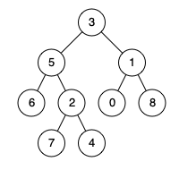

# 剑指 Offer 68 - II. 二叉树的最近公共祖先

> 来源：[力扣（LeetCode）](https://leetcode-cn.com/problems/er-cha-shu-de-zui-jin-gong-gong-zu-xian-lcof)

## Problem

给定一个二叉树, 找到该树中两个指定节点的最近公共祖先。

> 百度百科中最近公共祖先的定义为：“对于有根树 T 的两个结点 p、q，最近公共祖先表示为一个结点 x，满足 x 是 p、q 的祖先且 x 的深度尽可能大（一个节点也可以是它自己的祖先）。”

例如，给定如下二叉树:  `root = [3,5,1,6,2,0,8,null,null,7,4]`

  

**示例 1:**

```
输入: root = [3,5,1,6,2,0,8,null,null,7,4], p = 5, q = 1
输出: 3
解释: 节点 5 和节点 1 的最近公共祖先是节点 3。
```

**示例 2:**

```
输入: root = [3,5,1,6,2,0,8,null,null,7,4], p = 5, q = 4
输出: 5
解释: 节点 5 和节点 4 的最近公共祖先是节点 5。因为根据定义最近公共祖先节点可以为节点本身。
```

**说明:**

- 所有节点的值都是唯一的。
- `p`、`q` 为不同节点且均存在于给定的二叉树中。

## Solution

本题采用深度优先的 ++回溯法++。可以分为两种策略

1. 分别记录节点 `p`, `q` 的路径
2. 记录最近公共祖先

### 解法一：记录路径

```java
/**
 * Definition for a binary tree node.
 * public class TreeNode {
 *     int val;
 *     TreeNode left;
 *     TreeNode right;
 *     TreeNode(int x) { val = x; }
 * }
 */
class Solution {

    public TreeNode lowestCommonAncestor(TreeNode root, TreeNode p, TreeNode q) {
        if (root == null) return null;

        List<TreeNode> pathP = new ArrayList<>();
        List<TreeNode> pathQ = new ArrayList<>();

        getPath(root, p, pathP);
        getPath(root, q, pathQ);

        int i = 0;
        int max = Math.min(pathP.size(), pathQ.size());
        for (;i < max && pathP.get(i) == pathQ.get(i); i++);

        return i > 0 ? pathP.get(i - 1) : null;
    }

    private void getPath(TreeNode node, TreeNode target, List<TreeNode> path) {
        if (node == null) return;

        path.add(node);
        
        if (node == target) return;

        getPath(node.left, target, path);

        if (path.get(path.size() - 1) == target) return;

        getPath(node.right, target, path);

        if (path.get(path.size() - 1) == target) return;

        path.remove(path.size() - 1);
    }
}
```

**解法二：** 记录最近公共祖先

定义方法 `boolean contains(node, p, q)` 返回 `node`（包括 `node`， `node.left`, `node.right`） 是否包含 `p` 或 `q` 中的一个。

令
$$
\begin{aligned}
cl &= contains(node.left,\ p,\ q)\\
cr &= contains(node.right,\ p,\ q)
\end{aligned}
$$

当满足以下两个条件时，得到所求 ++最近公共祖先++：

1. 当 `cr && cl` 时，表示左子树与右子树分表包含`p`、`q`，此时 `node` 为所求。
2. 当 `cr || cl` 且 `node == p || node == q` 时，表示 node 为其中一个节点，且其子节点包含另外一个，故 `node` 为所求。

```java
/**
 * Definition for a binary tree node.
 * public class TreeNode {
 *     int val;
 *     TreeNode left;
 *     TreeNode right;
 *     TreeNode(int x) { val = x; }
 * }
 */
class Solution {
    private TreeNode res;

    public TreeNode lowestCommonAncestor(TreeNode root, TreeNode p, TreeNode q) {
        contains(root, p, q);
        return res;
    }

    private boolean contains(TreeNode node, TreeNode p, TreeNode q) {
        if (node == null) return false;

        boolean cl = contains(node.left, p, q);
        boolean cr = contains(node.right, p, q);

        if (cl && cr || (node.val == p.val || node.val == q.val) && (cl || cr)) {
            res = node;
        }
        return node.val == p.val || node.val == q.val || cl || cr;
    }
}
```
