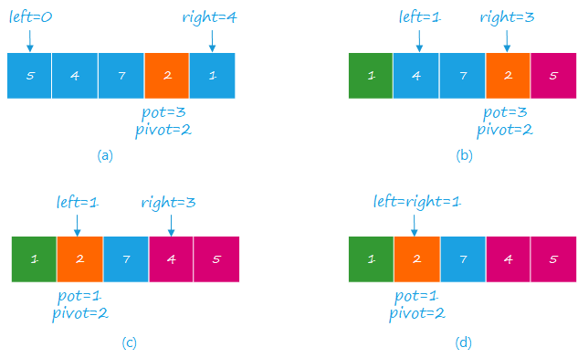

# 快速排序 <todo/>

快速排序是对冒泡排序的一种优化，利用冒泡，将元素分为大于，等于基准值的两部分。

<diagram type="block">
    Smaller[col=7]
    Pivot[col=4]
    Larger[col=8]
</diagram>


快速排序是将元素分区，然后再分治进行排序的方法。首先选取一个基准元素 $pivot$，然后移动元素，使得左边的元素 $<pivot$，右边的元素 $>pivot$。

元素的移动主要有两种方法：

1. 挖坑法
2. 指针交换法

选择基准元素的方法：

1. 首尾、中间元素
2. 随机

时间复杂度：

- **最差**：$O(n^2)$，此时给定数组正好是逆序
- **平均**：$O(n \log n)$

## 1. 挖坑法

**定义：**

- $pit$ 记录坑的位置
- $pivot$ 记录基准元素
- $left$ 记录左索引
- $right$ 记录右索引

初始时，

$$
\left\{
\begin{aligned}
    pit     &= 0\\
    pivot   &= a_{pit} = a_0\\
    left    &= 1\\
    right   &= n-1
\end{aligned}
\right.
$$

开始时从右边开始扫描，得到元素 $a_{right}$，此时会出现两种情况：

1. $a_{right} < pivot$，则
   1. 将 $a_{right}$ 放入 $a_{pit}$
   2. 将 $right$ 标记为 $pit$
2. $a_{right} >= pivot$，则移动 $right$ 至 $right - 1$，直到出现 $a_{right} < pivot$。

然后当 $pit$ 在右侧时，再类似地从左边往右边扫描，此时：

1. $a_{left} >= pivot$，则将 $a_{left}$ 放入 $a_{pit}$，并将 $left$ 标记为 $pit$
2. $a_{left} < pivot$，则移动 $left$ 至 $left - 1$，直到出现 $a_{left} >= pivot$。

当 $left=right$ 时结束。

经过一趟遍历之后，就可以将小于 $pivot$ 的数据分到左边，大于 $pivot$ 的数据分到右边。
然后再对左右两边的数据分别递归的进行处理。

终止条件：<todo/>

## 2. 指针交换法

设 $pit$ 代表基准元素的位置，初始时，

$$
\left\{
\begin{aligned}
    pit     &= 0 \\
    pivot   &= a_{pit} = a_0 \\
    left    &= 1 \\
    right   &= n - 1\\
\end{aligned}
\right.
$$

开始时，类似[挖坑法](#1-挖坑法)，移动 $left$、$right$ 指针，当出现 $a_{right} \leq pivot < a_{left}$ 时，交换 $a_{right}$ 与 $a_{left}$，直到 $left = right$。
此时，$pit$ 与 $left$ 对应元素。

类似[挖坑法](#1-挖坑法)，经过一趟遍历，可以使 $pivot$ 处于正好第 $k$ 大的位置，并将数组 $a$ 进行了左右分组。

```java
class Solution {
    public int[] sortArray(int[] nums) {
        return sort(nums, 0, nums.length - 1);
    }

    public int[] sort(int[] nums, int left, int right) {
        int i = left, j = right;
        int pivot = nums[i];

        while (left < right) {
            while(nums[right] > pivot && right > left) right--;
            while(nums[left] <= pivot && left < right) left++;

            if (left < right) {
                swap(nums, left, right);
            } else if (left == right) {
                swap(nums, left, i);
            }
        }
        if (left > i + 1) sort(nums, i, left - 1);
        if (left < j - 1) sort(nums, left + 1, j);
        return nums;
    }

    private void swap(int[] nums, int i, int j) {
        int tmp = nums[i];
        nums[i] = nums[j];
        nums[j] = tmp;
    }
}
```

:::tip 关于随机选择基准元素

随机选择基准元素 $pivot$ 时，考虑两种情况

1. $pivot$ 在左侧，当 $pit=left$ 时，由于 $a_{left}<=pivot$，`lef++`， 最后当指针 $left = right$ 时，交换 $a_{left}$ 与 $a_pit$即可。
2. $pivot$ 在右侧，当 $pit=right$ 时，由于 $a_{right}=pivot$，需要将right移动到左侧，交换 $a_{right}$ 与 $a_{left}$，并标记 $pit=left$。最后当指正 $left=right$时结束循环。

      

**随机元应当与 $left$ 交换，则算法与选择第一个元素为 $pivot$ 相同。**

:::

## 非递归方法 <todo/>

##  快排的优化

1. 随机基准元素
2. 选中位数作为基准元素
3. 双路划分
4. 三路划分

### 2. 双路划分（Two-way Partition）

通过首尾双指针进行交换，由于每次交换必然会使小于 $pivot$ 的值在左侧，大于 $pivot$ 的值在左侧，故可以减少交换次数，提升效率。

### 4. 三路划分（Three-way Partition）

三路划分是将数据划分为如下三部分（$pivot$ 表示基准元素）

<diagram type="block" title="Fig. Three-way Partition">
    &lt; pivot[col=4]
    =pivot[col=8]
    &gt;pivot[col=6]
</diagram>

**元素重复较多时，能显著提升效率**。在递归时，绕过 `=pivot` 部分，只对 `<pivot` 与 `>pivot` 进行递归排序。

<diagram type="block" title="Fig. Being Sorting">
    bigger[col=2]
    pivot[col=2,bg=green]
    ···[col=4,bg=green]
    pivot[col=2,bg=green]
    &gt;pivot[col=6,bg=red]
</diagram>

<diagram type="block">
    &lt;pivot[col=4]
    pivot[col=2,bg=green]
    ···[col=4,bg=green]
    pivot[col=2,bg=green]
    &gt;pivot[col=6,bg=red]
</diagram>

```
+---------+-------+---------+-+-------------
| less    | equal | greater | |
+---------+-------+---------+-+-------------
         ^        ^          ^
         el       eh         i

el + 1  : first equal
eh      : last equal
i       : iteration index
```

```java
void quickSort(int[] nums, int low, int high) {
    if (low == high) return;
    int el = low - 1, eh = low; // equal low, equal high
    int pit = (int)(Math.random() * (high - low)) + low;
    swap(nums, low, pit);
    int pivot = nums[low];
    for (int i = low + 1; i <= high; i++) {
        if (nums[i] < pivot) {  // Fond element < pivot
            swap(nums, ++eh, i);
            swap(nums, ++el, eh);
        } else if (nums[i] == pivot) {
            swap(nums, ++eh, i);
        }
    }

    quickSort(nums, low, el);
    quickSort(nums, eh + 1, high);
}
```

::: warning 与堆排序相比

堆排序时间复杂度最差的情况下是 $n \log n$，而快排平均复杂度为 $n \log n$，最差的情况下是 $O(n^2)$。那么两者优劣怎样？

堆排序优势：

1. 时间复杂度稳定
2. 空间上只需要 1 个记录大小作为辅助空间，空间复杂度为 $O(1)$

而根据知乎[^heap-vs-quick]的回答：

> 因为堆排序下，数据读取的开销变大。在计算机进行运算的时候，数据不一定会从内存读取出来，而是从一种叫 $cache$ 的存储单位读取。原因是 $cache$ 相比内存，读取速度非常快，所以 $cache$ 会把一部分我们经常读取的数据暂时储存起来，以便下一次读取的时候，可以不必跑到内存去读，而是直接在 $cache$ 里面找。
> 一般认为读取数据遵从两个原则：$temporal locality$，也就是不久前读取过的一个数据，在之后很可能还会被读取一遍；另一个叫 $spatial locality$，也就是说读取一个数据，在它周围内存地址存储的数据也很有可能被读取到。
> 因此，在读取一个单位的数据(比如 1 个 $word$ )之后，不光单个 $word$ 会被存入 $cache$，与之内存地址相邻的几个 $word$，都会以一个 $block$ 为单位存入 $cache$ 中。
> 另外，$cache$ 相比内存小得多，当 $cache$ 满了之后，会将旧的数据剔除，将新的数据覆盖上去。在进行堆排序的过程中，由于我们要比较一个数组前一半和后一半的数字的大小，而当数组比较长的时候，这前一半和后一半的数据相隔比较远，这就导致了经常在 cache 里面找不到要读取的数据，需要从内存中读出来，而当 $cache$ 满了之后，以前读取的数据又要被剔除。
> 简而言之**快排和堆排读取 $arr[i]$ 这个元素的平均时间是不一样的**。

最后可以的出结论是：**由于堆排序跳跃访问数据，不利于 CPU 的 cache 缓存，实际上快排用的远比堆排序多。**

:::

## 参考文献

- [三种快速排序以及快速排序的优化](https://blog.csdn.net/insistGoGo/article/details/7785038)

[^heap-vs-quick]: [作者：qinzp](https://www.zhihu.com/question/23873747/answer/327295185)
