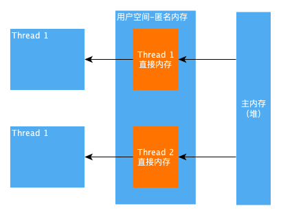
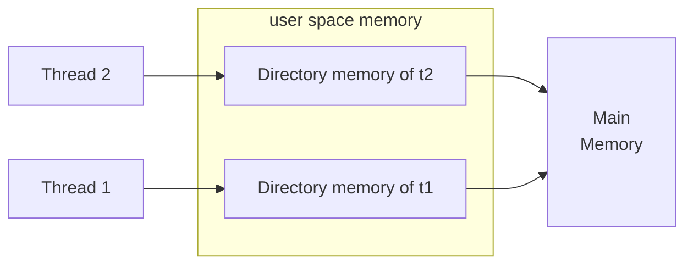

# Java 线程

Java(tm) 线程有三种创建方式

1. `implements Runnable`
2. `implements Callable`
3. `extends Thread`

## Runnable and Callable

`Runnable` 与 `Callable` 类似，需要实现 `run` 方法，然后通过 `Thread::start` 启动。
`Callable` 支持返回值，通过 `FutureTask` 获取，`Runnable` 不支持返回值。

**Runnable:**

```java
public class RunnableTest implements Runnable {
    public void run() {
        System.out.println("I'm printing.");
    }

    public static void main(String[] args) {
        Thread t1 = new Thread(new RunnableTest());
        t1.start();
    }
}
```

**Callable:**

```java {17}
import java.util.concurrent.Callable;
import java.util.concurrent.ExecutionException;
import java.util.concurrent.FutureTask;

public class CallableTest implements Callable<Integer> {
    public Integer call() throws InterruptedException {
        System.out.println("I'm printing.");
        Thread.sleep(2000);
        return 1;
    }

    public static void main(String[] args) throws ExecutionException, InterruptedException {
        CallableTest ct = new CallableTest();
        FutureTask<Integer> ft = new FutureTask<>(ct);
        Thread t1 = new Thread(ft);
        t1.start();
        System.out.println(ft.get());
        System.out.println("Out");
    }
}
```

**输出:**

```
I'm printing.
1
Out
```

:::tip
17 行调用 `ft.get()` 时，会阻塞当前线程。导致输出总是如下顺序：

```
1
Out
```

当没有调用 `ft.get()` 时，不发生阻塞，此时输出顺序随机。
:::

### Thread

在 `Thread` 内部，实际上是调用了 `Thread.run`，源码如下，

```java
public void run() {
    if (target != null) {
        target.run();
    }
}
```

通过源码可以看到，该方法最终调用的是 `target.run` 方法，而 `target` 则是构造实例时传入的 `Runnable` 实例。所以我们可以直接重写 `Thread.run` 方法，让它执行我们的任务。

```java
class ThreadTest extends Thread {
    public void run() {
        // do sth.
    }

    public static void main(String[] args) {
        Thread t1 = new ThreadTest();
        t1.start();
    }
}
```

:::warning
通过这种方式创建线程实际使用得较少，通常还是通过实现 `Runnable`（不需要返回值）、`Callable`（需要返回值）为主。
:::

### Thread Methods

以下，`t1` 代表线程实例, `Thread` 代表类。

#### 静态方法

| Method                           | Description                                          |
| -------------------------------- | ---------------------------------------------------- |
| `sleep(int milliseconds)` | 当前线程休眠                                         |
| `yield(void)`             | 当前线程让出资源，建议调度器让同优先级线程可以先执行 |
| `interrupted()`            | 判断当前线程是否有中断信号|
| `currentThread()`                 | 获取当前线程实例，可以调用 `getId()` 等实例方法

#### 实例方法

| Method                           | Description                                          |
| -------------------------------- | ---------------------------------------------------- |
| `join(void)`                  | 等待线程结束                                         |
| `interrupt()`                 | 向线程 `t1` 发送中断信号，此时如果 t1 正在 sleep，则会抛出 InterruptedException，如果 t1 中没有 sleep，则可以通过 `Thread.interrupted()` 方法来判断是否有中断信号，并作出相应处理。                             |
| `isInterrupted()`             |实例对应线程是否有中断信号|

### Daemon

Java&trade;中的线程分为两种，

1. 用户线程<Badge text="default" type="warning"/>
2. 守护线程

两者区别在于：

1. 守护线程优先级比用户线程低。
1. 用户线程全部退出后，此时不管有没有守护线程，程序都将退出。

调用方式：

```java {3}
Thread t = new MyThread();

t.setDaemon(true); // 需要在 `start` 之前设置
t.start();
```

守护线程主要用于给程序提供额外服务如：保持网络连接，当用户进程已经全部退出时，保持网络连接也就没有必要了。

## 线程安全

线程安全是指线程资源的同步或互斥。Java&trade; 提供两种机制保证线程安全

1. `synchronized`： JVM提供
2. `java.util.concurrent.ReentrantLock`： JDK 提供

两者性能相当。

### synchronized

`synchronized` 提供了对类、对象的锁机制，分别作用于代码块和方法。

```java
// Lock the instance: `instance`
synchronized (instance) {
}

// Lock the class: `SomeClass`
synchronized (SomeClass.class) {
}

// Lock current instance
public synchronized void doSth1() {
}

// Lock current class
public static synchronized void doSth2() {
}
```

### ReentrantLock

可重入锁，由 JDK 提供，需要开发者显示调用 `lock`， `unlock` 操作，锁定资源为同一个 `ReentrantLock` 实例。

Example：

```java
public class ReentrantLockTest {
    public static void main(String[] args) throws IOException {
        /**
         * lock 实例在 Runnable 之前创建，作用域包括两个线程。
         * 此时，两个线程发生锁
         */
        ReentrantLock lock = new ReentrantLock();
        Runnable a = () -> {
            for (int i = 0; i < 10; i++) {
                try {
                    lock.lock();
                    System.out.println(i);
                } finally {
                    lock.unlock();
                }
            }
        };

        Thread t1 = new Thread(a);
        Thread t2 = new Thread(a);
        t1.start();
        t2.start();
    }
}
```

以上代码中，`lock` 对象在一个线程中锁定，另一个线程只能等待。

`ReentrantLock` 锁可以嵌套（重入），其 `lock` 与 `unlock` 必须匹配，否则可能造成死锁问题：

```java
reentrantLock.lock();
    reentrantLock.lock();
    // ...
    reentrantLock.unlock();
reentrantLock.unlock();
```

## Executor

Executor 是一个线程管理器，当不需要线程之间通信时，可以使用它来执行线程，代替 `new Thread(); thread.start()`;

## 线程池类型

- `newCachedThreadPool()`：按需创建线程
- `newFixedThreadPool()`：创建固定线程数的线程池
- `newSingleThreadExecutor()`: 相当于 $size = 1$ 的 `newFixedThreadPool()`

**Example：**

```java {8,9}
import java.util.concurrent.ExecutorService;
import java.util.concurrent.Executors;

public class ExecutorTest {
    public static void main(String[] args) {
        ExecutorService executorService = Executors.newSingleThreadExecutor();
        for (int i = 0; i < 5; i++) {
            // 等价于 new Thread(new MyRunnable(i)).start();
            executorService.execute(new MyRunnable(i));
        }
        executorService.shutdown();
        System.out.println("shutdown");
    }

    private static class MyRunnable implements Runnable {
        private final int number;

        public MyRunnable(int number) {
            this.number = number;
        }

        @Override
        public void run() {
            System.out.println(" in: " + number);
            try {
                Thread.sleep(3000);
            } catch (InterruptedException e) {
                e.printStackTrace();
            }
            System.out.println("out: " + number);
        }
    }

}

```

其中 `ExecutorService` 方法

- `showdown()` ： 标记关闭线程池，不再接受新的线程加入。
- `showdownNow()` 同时向所有线程发送中断（interrupt）信号。
- `awaitTermination(long timeout, TimeUnit unit)` 阻塞线程，直到其一发生：阻塞时间超过 timeout, 所有线程都结束，当前线程收到中断信号。

## 线程通信

线程通信根据资源锁不同，主要有两种方式

1. `synchronized` 锁，使用 `wait()`, `notify()`, `notifyAll()`
2. `ReentrantLock` 锁，使用 `await()`, `signal()`, `signalAll()`

CountDownLatch：基于 *AQS*
CyclicBarrier： 基于 `ReentrantLock`，可以通过 reset 方法重启计数，所以称 “循环（cyclic）屏障”
Semaphore：

- `FutureTask`：获取 `Callable` 的返回值
- `BlockingQueue`，接口，阻塞队列，用 `put()` 入队，`take()` 出队，可以模拟*生产者-消费者*模式。
- `ForkJoin`：并行计算，类似 *MapReduce*，利用 `fork()/join()` 方法，进行任务拆分、重组。并实现了 *工作窃取算法* （当前线程任务执行完毕，获取其他线程队列末尾的任务执行）。

AQS: `AbstractQueuedSynchronizer`，基于 `volatile`（synchronized variables）

## 内存模型

### 三大特性

1. 原子性
2. 可见性
3. 有序性

### 先行发生原则

1. 单一线程原则
2. 管程锁定规则
3. `volatile` 变量规则
4. 线程启动规则
5. 线程加入规则
6. 线程中断规则
7. 线程终结规则
8. 传递性

## 锁类型

synchronized & ReentrantLock 是互斥同步，也成阻塞同步，悲观锁。

- 悲观锁：总认为资源会被抢占。
- 乐观锁：尝试操作，成功则退出，失败则再次尝试

## 非阻塞同步

1. CAS
2. AtomicInteger
3. ABA

### 1. CAS

> Compare-and-Swap

乐观锁需要操作和冲突检测这两个步骤具备原子性，这里就不能再使用互斥同步来保证了，只能靠硬件来完成。硬件支持的原子性操作最典型的是：比较并交换（Compare-and-Swap，CAS）。CAS 指令需要有 3 个操作数，分别是内存地址 V、旧的预期值 A 和新值 B。当执行操作时，只有当 V 的值等于 A，才将 V 的值更新为 B。

### 2. AtomicInteger

### 3. ABA

## JVM 对 synchronized 的优化

1. 自旋锁
2. 锁消除
3. 锁粗化
4. 轻量级锁
5. 偏向锁

## volatile

与 `synchronized` 类似，但只能用于修饰属性。

**Example：**

```java {2}
public class VolatileTest {
    private volatile boolean flag = false;

    public static void main(String[] args) {

        VolatileTest test = new VolatileTest();
        new Thread(() -> {
            try {
                Thread.sleep(1000);
                test.flag = true;
            } catch (InterruptedException e) {
                e.printStackTrace();
            }
        }).start();
        
        while(true) {
            if (test.flag) {
                System.out.println("Main out");
                break;
            }
        }
    }
}
```

上例中，如果没有 `volatile` 修饰，永远无法看到 'Main out' 输出。

:::detail Thread.sleep

`Thread.sleep` 可以得到类似 `volatile` 屏障的作用，但是没有任何文档可以支撑。甚至官方文档表示 `Thread.sleep` 没有任何同步的语义。^[[Chapter 17. Threads and Locks](https://docs.oracle.com/javase/specs/jls/se8/html/jls-17.html#jls-17.3)]

例如以下代码可以正确看到其他线程的修改。

```java
public class VolatileTest {
    private boolean flag = false;

    public static void main(String[] args) {

        VolatileTest test = new VolatileTest();
        new Thread(() -> {
            try {
                Thread.sleep(1000);
                test.flag = true;
            } catch (InterruptedException e) {
                e.printStackTrace();
            }
        }).start();
        
        while(true) {
            try {
                Thread.sleep(0);
            } catch (InterruptedException e) {
                e.printStackTrace();
            }
            if (test.flag) {
                System.out.println("Main out");
                break;
            }
        }
    }
}
```

> 是因为由于线程从运行到睡眠再到运行之间的上下文切换？

:::

JVM 内存模型：拷贝共享内存到线程内存。**如果不干预，何时同步？**





其中*直接内存*存放在用户空间，不属于堆，不受堆内存限制。

**总结：**

1. `volatile` 修饰符适用于以下场景：某个属性被多个线程共享，**其中有一个线程修改了此属性，其他线程可以立即得到修改后的值**；或者作为状态变量，如 `flag = true`，实现轻量级同步。
2. 不具备原子性，只具备可见性

    ```java
    volatile int cnt =  1;
    // 以下操作不具备原子性
    cnt++;
    cnt += 1;
    ```

    `volatile` 的原子性只对 ++简单赋值++（`cnt = 2`）、++读取++ 有效。

## 线程间通信

`synchronized` 中的 wait, notify

ReentrantLock J.U.C.Condition 的通信 await, signal, signalAll
