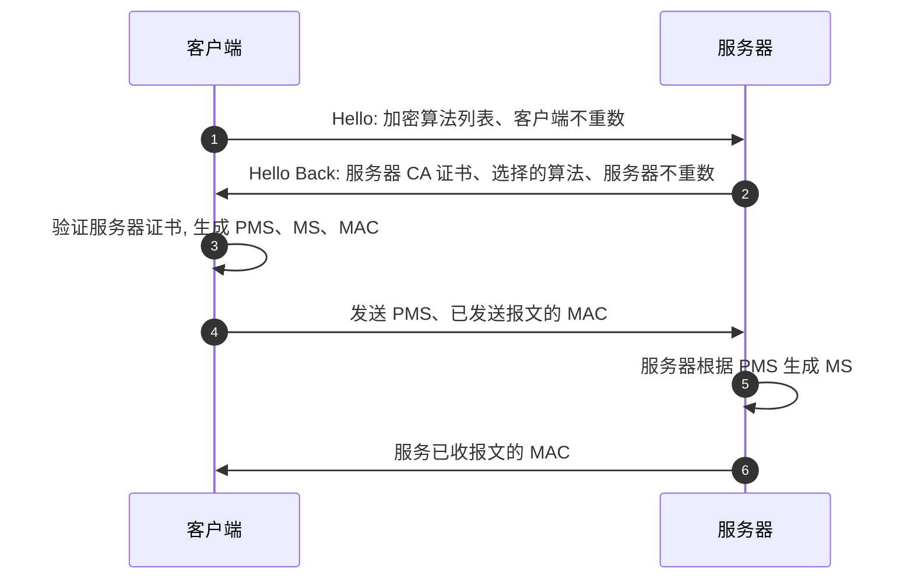
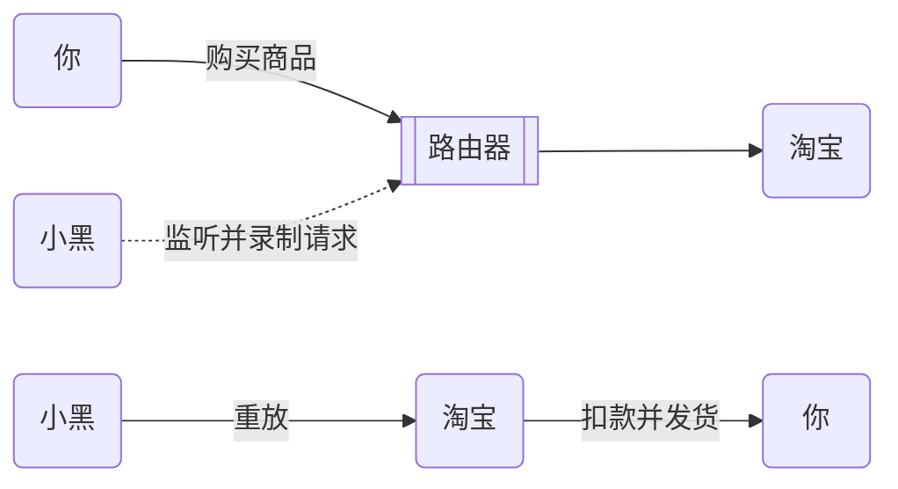

# 传输层安全: SSL 与 TLS

SSL 与 TLS 都是为了加强 TCP 协议的安全性，分别为以下缩写：

- TLS: <acr>Transport Layer Security</acr>
- SSL: <acr>Secure Socket Layer</acr>

## SSL 与 TLS 的历史

SSL 由 Netscape 设计并发布，而后交给 ISO，并更名为 TLS。由于这样的历史原因， SSL 与 TLS 两个术语有时会互换使用。

- 1994年，Netscape 公司设计了 SSL 协议（Secure Sockets Layer）的 1.0 版，但是未发布。

- 1995年，Netscape 公司发布 SSL 2.0 版，很快发现有严重漏洞。

- 1996年，SSL 3.0 版问世，得到大规模应用。

- 1999年，互联网标准化组织 ISO 接替 Netscape 公司，发布了 SSL 的升级版，为了表明与 Netscape 不再有关联，更名为 TLS 1.0 版。

- 2006年，发布了 TLS 1.1。
- 2008年，发布了 TLS 1.2。
- 2011年，发布了 TLS 1.2 的修订版。
- 2018年，发布了 TLS 1.3。

:::tip
为了方便描述，以下我们使用 TLS 表示这两个加密算法。
:::

## 工作原理

当客户端需要建立一个 TLS 连接时，首先通过会建立一条 TCP 连接。在这之后，再经过 4 次握手，完成了 TLS 连接。
在这里，我们把注意力放在后面这 4 次连接上，其连接过程如图 1（后面会详细解释建立过程）。

@@caption 图 1  TLS 连接建立过程

::: tip Terminology

- MAC: Message Authentication Code，安全鉴别吗。作为签名附在正文后。
- PMS: Pre-Master Secret，前主秘钥。用于计算主秘钥。
- MS: Master Secret，主秘钥。用于生成双方数据传输的 **对称秘钥** 以及生成签名的 **鉴别秘钥**。
- Nonce: Unique random number，随机数。防重放攻击。

:::

建立具体过程如下，

1. 客户端向服务器发送 hello 报文。 报文中列出客户端支持的全部算法等信息，具体如下：
    - 客户端支持的加密算法
    - 客户端不重数（client nonce，其作用稍后做出解释)
2. 服务器响应 hello 报文。此时服务器返回做出的选择等信息，具体如下，
    - 服务器挑选的算法
      - 对称加密算法
      - CA 证书（包含服务器公钥）
      - 报文鉴别码（MAC） 生成算法，记作 $H$，该算法前后端相同
    - 服务器不重数（server nonce）
3. 客户端生成前主秘钥（Pre-Master Secret, PMS），用于计算主秘钥（Master Secret, MS），MS 最终分割成两个部分：
   1. 鉴别秘钥，用于计算 MAC，记作 $s$。MAC 算法如下
        $$
        MAC = H(s + message) \tag{1}
        $$
   2. 客户端对称秘钥，用于加密客户端到服务器的报文。
4. 客服端发送 PMS 以及已发送报文的 MAC，这些报文是在加密算法协商过程中发送，所以未曾加密。
   1. PMS, 服务器可以使用 PMS 生成主秘钥 PM、对称加密秘钥、报文鉴别秘钥
   2. MAC, 通过级联客户端已发送和已收到所有握手报文计算得到。注意到与之前不同，此时的 MAC 是在客户端加密了之后发送的。
   > 这个时候，客户端的握手就完成了。
5. 服务器计算 MS 、MAC，并对比是否与客户端传输的 MAC 一致。保证密码协商时报文未被篡改。
6. 服务器响应 MAC，类似客户端发送的 MAC，该 MAC 是由所有从服务器端观测到的报文计算得到。

通过上述几个步骤，便完成了客户端与服务器的握手，期间客户端与服务器会进行 4 次交互，所以**称为 4 次握手**。随后发送的报文，将通过对称加密传输（考虑到非对称加密的速度相对慢很多）。

:::tip 对称与非对称加密速度差多少？
对于 DES 与 RSA，如果用软件实现，DES 速度比 RSA 快 100 被，用硬件实现则快 1000 ~ 10000 倍，所以实际应用中，RSA 通常会与对称加密结合起来。[^speed-diff]
:::

最后当握手完成时，将产生 4 个秘钥，分别是：

> 这里我们假设是 Alice（作为客户端） 与 Bob（作为服务器）之间传递数据。

1. $E_B$, Bob 的对称秘钥，用于加密发送给 Alice 的数据。
2. $M_B$, Bob 的鉴别秘钥，用于签名发送给 Alice 的数据。
3. $E_A$, Alice 的对称秘钥，用于加密发送给 Bob 的数据。
4. $M_A$, Alice 的鉴别秘钥，用于签名发送给 Bob 的数据。

:::tip
四个秘钥 Alice 与 Bob 共享，都是通过 PMS 计算得到。这种从 PMS 中计算得到的方式，使得通信双方可以不直接传输秘钥，就可以达成一致的结果，进一步保证了安全性。
:::

例如，Bob 向 Alice 发送数据时，

$$
\begin{aligned}
    c &= E_B(m + H(M_B + m)) \\
\end{aligned}
$$

其中 $c$ 代表密文（cypher），$m$ 代表明文。

可能还有一些问题没有解决，我们继续往下看。

## 问答时间

**Q. 为什么客户端与服务器需要使用不重数（nonce）？**

**A.** 为了避免[重放攻击](https://zh.wikipedia.org/wiki/%E9%87%8D%E6%94%BE%E6%94%BB%E5%87%BB)。假设你从淘宝购买了意见商品，并完成了扣款，而这个过程被第三者小黑监听了（比如你连了他家的 WiFi）。他虽然无法知道你购买商品的细节，但是（先假设没有不重数），他可以录制你的所有请求，然后第二天再次想淘宝发起请求。淘宝此时认为你是要购买相同的商品，于是又把支付宝给你扣了。下图展示着这个过程

@@caption 图 2  重放攻击

有了不重数，淘宝知道这次收到的请求是无效的。因为协商的秘钥中，包含了双方的不重数，从而每次建立的请求，服务器都会生成不同的秘钥，淘宝知道它的不重数并不包含在小黑发送的 PMS 中，从而可以判断这是一条非法的请求，于是断开链接。

**Q. 为什么客户端和服务器在握手的第 4、6 步时要发送报文鉴别码 MAC？**

**A.** 在握手时，前几次的报文交换并没有加密，此时如果小黑监听了通信双方，便可以修改报文。比如客户端会传给服务器所支持的加密算法列表（第 1 步），这些算法的安全性不一样，小黑可以删掉安全性强的算法，留下有漏洞的算法，服务器就没得选，只能用有漏洞的算法进行传输。而在有 MAC（通过加密传输）的情况下，服务器便知道收到的数据被篡改了，从而中断连接。

## 参考文献

- [SSL/TLS协议运行机制的概述 - 阮一峰的网络日志](http://www.ruanyifeng.com/blog/2014/02/ssl_tls.html)
- [What is Transport Layer Security? | TLS protocol | Cloudflare](https://www.cloudflare.com/zh-cn/learning/ssl/transport-layer-security-tls/)
- [为什么 HTTPS 需要 7 次握手以及 9 倍时延 - 面向信仰编程](https://draveness.me/whys-the-design-https-latency/)
- [What is SSL, TLS? And how this encryption protocol works | CSO Online](https://www.csoonline.com/article/3246212/what-is-ssl-tls-and-how-this-encryption-protocol-works.html)

[^speed-diff]: 《计算机网络：自顶向下的方法》 原书第 7版, P395
